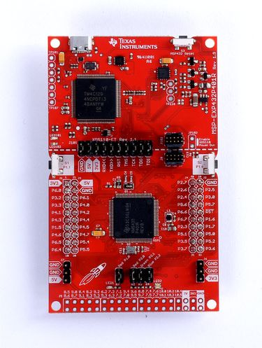

# MSP-EXP432P401R

TI MSP432P401R LaunchPad board

You need install CCS UniFlash to download firmware.

Note: MS432R401R use `9600` buadrate.

[MSP-EXP432P401R baord document](http://www.ti.com/tool/MSP-EXP432P401R)

