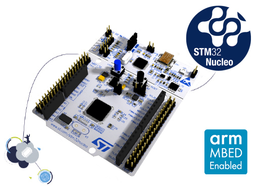

# Nucleo-F091RC

STMicroelectronics Nucleo-F091RC baord.

You may using STM32 ST-LINK Utility to download firmware (HEX/bin).

[Nucleo-F091RC baord document](http://www.st.com/content/st_com/en/products/evaluation-tools/product-evaluation-tools/mcu-eval-tools/stm32-mcu-eval-tools/stm32-mcu-nucleo/nucleo-f091rc.html)

