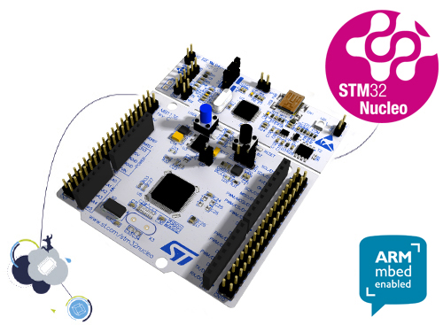

#Nucleo-F411RE
STMicroelectronics Nucleo-F411RE baord.

You may using STM32 ST-LINK Utility to download firmware (HEX).

[Nucleo-F411RE baord document](http://www.st.com/content/st_com/en/products/evaluation-tools/product-evaluation-tools/mcu-eval-tools/stm32-mcu-eval-tools/stm32-mcu-nucleo/nucleo-f411re.html)

