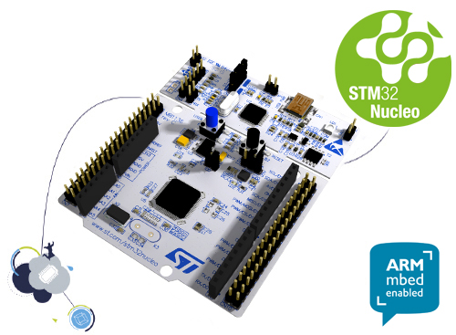

#Nucleo-L476RG
STMicroelectronics Nucleo-L476RG baord.

You may using STM32 ST-LINK Utility to download firmware (HEX).

[Nucleo-L476RG baord document](http://www.st.com/content/st_com/en/products/evaluation-tools/product-evaluation-tools/mcu-eval-tools/stm32-mcu-eval-tools/stm32-mcu-nucleo/nucleo-l476rg.html)

