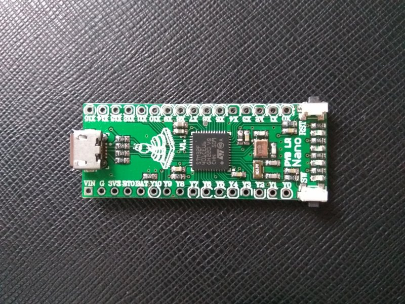
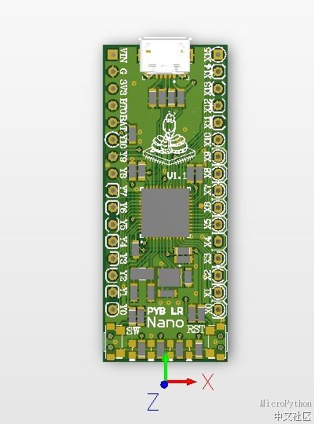

#PYB Nano v1.1
PYB Nano is a smallest pyb baord, compatible with PYBV10 board. 

PYB Nano is design by MicroPython Chinese community, low cost, and easy to use.

[PYB Nano document](http://www.micropython.org.cn/forum.php?mod=viewthread&tid=329)

