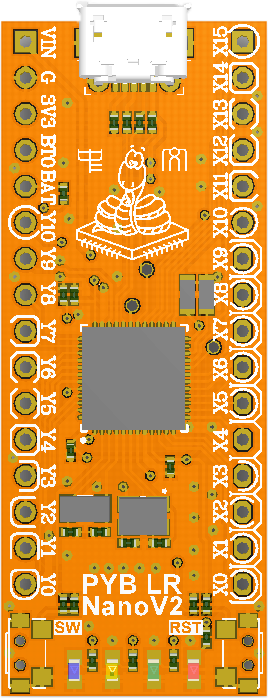

# pyboardCN V2

PYBNANO V2 is a mini **micropython** board, with STM32F411 microcontroller, **8 MByes** flash, compatible with PYBV10. 

[http://www.micropython.org.cn](http://www.micropython.org.cn)
