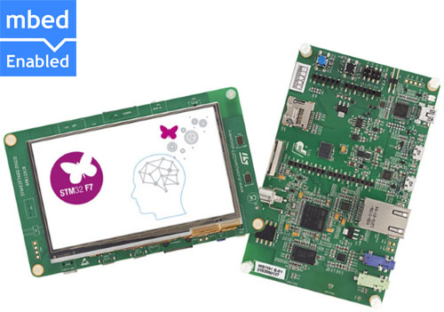

# STM32F7DISC

STMicroelectronics STM32F7DISC baord.

You may using STM32 ST-LINK Utility or dfu to download firmware (HEX).

[STM32F7DISC baord document](http://www.st.com/en/evaluation-tools/32f746gdiscovery.html)

