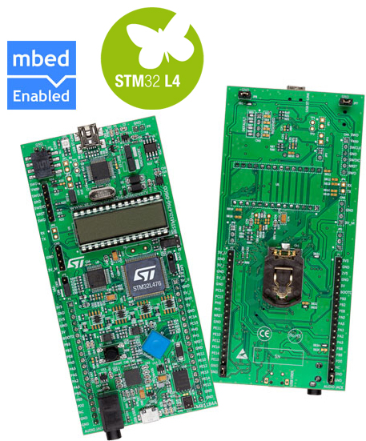

# STM32L476DISC

STMicroelectronics 32L476GDISCOVERY baord.

You may using STM32 ST-LINK Utility to download firmware (HEX).

[STM32L476DISC baord document](http://www.st.com/content/st_com/en/products/evaluation-tools/product-evaluation-tools/mcu-eval-tools/stm32-mcu-eval-tools/stm32-mcu-discovery-kits/32l476gdiscovery.html)

