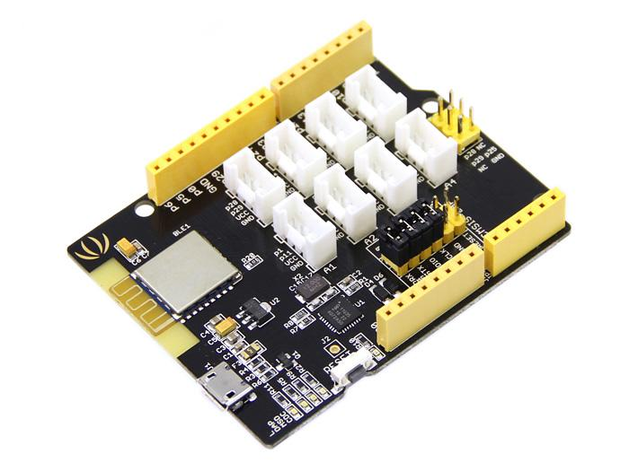

#Seeed Arch BLE
Arch BLE is an mbed enabled development board based on Nordic nRF51822. With Arduino form factor and Grove connectors, it is extremely easy to create a Bluetooth Low Energy(BLE) device.

The nRF51822 is a powerful multi-protocol single chip solution for ULP wireless applications. It incorporates Nordic’s latest best-in-class performance radio transceiver, an ARM Cortex M0 MCU and 256kB flash + 16kB RAM memory. The nRF51822 supports Bluetooth? low energy and 2.4 GHz protocol stacks.

[Document](http://wiki.seeed.cc/Arch_BLE/)

##Pin map
    pin0:   p3
    pin1:   p2
    pin2:   p1
    pin3:   p4
    pin4:   p5
    pin5:   p17  BTN_A
    pin6:   p12
    pin7:   p11
    pin8:   p18
    pin9:   p10
    pin10:  p6
    pin11:  p26  BTN_B
    pin12:  p20
    pin13:  p29  SCK
    pin14:  p28  MISO
    pin15:  p25  MOSI
    pin16:  p30  BLUE LED
    pin19:  p6   SCL
    pin20:  p5   SDA

### Modify:

* bbcmicrobit\yotta_modules\microbit-dal\inc\MicroBit.h

`from`
    #define MICROBIT_PIN_SDA                        P0_30
    #define MICROBIT_PIN_SCL                        P0_0

`to`
    #define MICROBIT_PIN_SDA                        P0_5
    #define MICROBIT_PIN_SCL                        P0_6

* bbcmicrobit\yotta_modules\microbit-dal\inc\MicroBitPin.h

`from`
    #define MICROBIT_PIN_P13                    P0_23       //SCK
    #define MICROBIT_PIN_P14                    P0_22       //MISO
    #define MICROBIT_PIN_P15                    P0_21       //MOSI
    #define MICROBIT_PIN_P16                    P0_16       //PIN 16
    #define MICROBIT_PIN_P19                    P0_0        //SCL
    #define MICROBIT_PIN_P20                    P0_30       //SDA

`to`
    #define MICROBIT_PIN_P13                    P0_29       //SCK
    #define MICROBIT_PIN_P14                    P0_28       //MISO
    #define MICROBIT_PIN_P15                    P0_25       //MOSI
    #define MICROBIT_PIN_P16                    P0_30       //PIN 16
    #define MICROBIT_PIN_P19                    P0_6        //SCL
    #define MICROBIT_PIN_P20                    P0_5        //SDA

* bbcmicrobit\yotta_modules\mbed-classic\targets\hal\TARGET_NORDIC\TARGET_MCU_NRF51822\TARGET_NRF51_MICROBIT\PinNames.h

`from`

    TGT_TX = p24,
    TGT_RX = p25,

`to`

    TGT_TX = p8,
    TGT_RX = p7,

## Interface
I2C
SDA=p5
SCL=p6

SPI
SCK=p29
MOSI=p25
MISO=p28

UART
TX=p8
RX=p7

[MicroPython中文社区](http://www.micropython.org.cn/)版权所有，保留所有权利

Copyright by [MicroPython Chinese community](http://www.micropython.org.cn/)