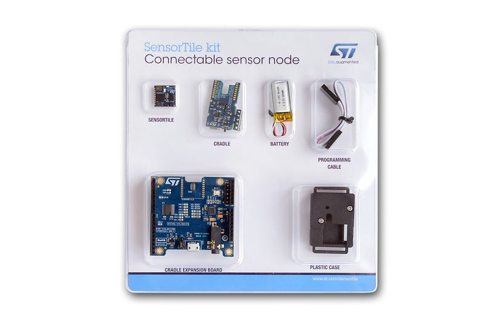

#SensorTile
STMicroelectronics SensorTile development kit (STEVAL-STLKT01V1)

You may using STM32 ST-LINK Utility to download firmware (HEX).

[SensorTile document](http://www.stmicroelectronics.com.cn/content/st_com/zh/products/evaluation-tools/solution-evaluation-tools/sensor-solution-eval-boards/steval-stlkt01v1.html)

